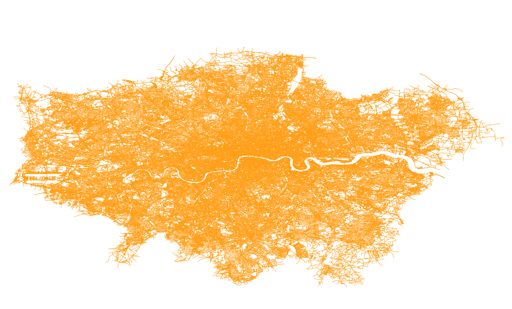

# Prep

Grab a copy of [QGIS](https://qgis.org/en/site/), I have 3.20.2-Odense.

You'll need a map of [all the roads in London](https://download.geofabrik.de/europe/great-britain/england/greater-london.html) via Open Street Map.

And a [map of the electoral ward boundaries](https://data.london.gov.uk/dataset/statistical-gis-boundary-files-london) in London.

## All the roads

Extract `greater-london-latest-free.shp.zip` and you'll find an ESRI Shapefile called `gis_osm_roads_free_1.shp`. Pop that open in QGIS.

## All the electoral wards

Secondly, extract `London-wards-2018.zip` and grab `London_Ward.shp` and open that as a second layer in the same QGIS project as above.

