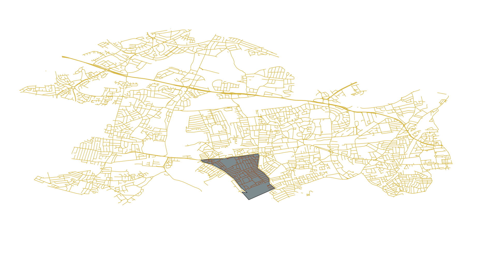
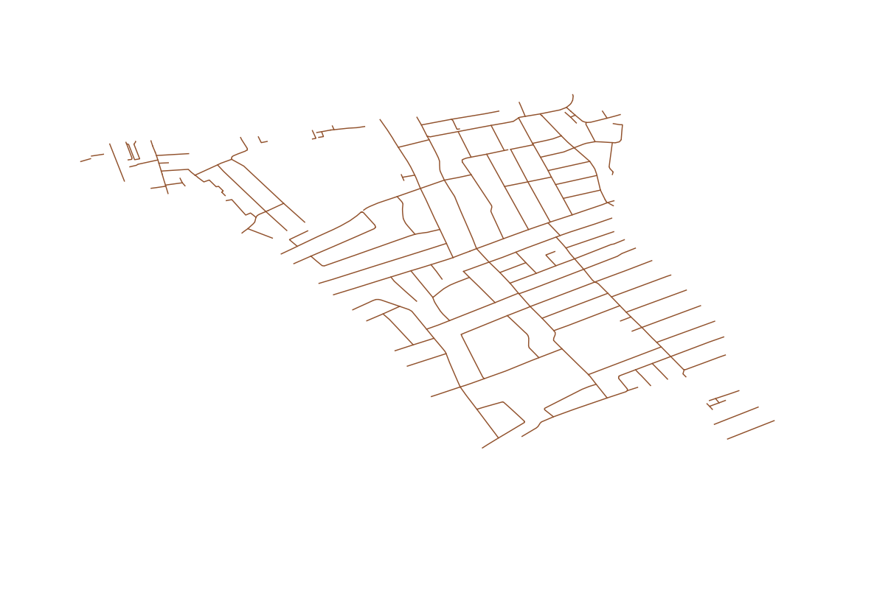

Q. How much of Ealing road network was converted to low-traffic neighbourhoods during the pandemic?

A. About 54km, or 9% of the public road infrastruction in the borough.

Here's a few notes on using QGIS do work this out.

# Prep

Grab a copy of [QGIS](https://qgis.org/en/site/), I have 3.20.2-Odense.

You'll need a map of [all the roads in London](https://download.geofabrik.de/europe/great-britain/england/greater-london.html) via Open Street Map.

And a [map of the electoral ward boundaries](https://data.london.gov.uk/dataset/statistical-gis-boundary-files-london) in London.

## All the roads

Extract `greater-london-latest-free.shp.zip` and you'll find an [ESRI Shapefile](https://en.wikipedia.org/wiki/Shapefile) called `gis_osm_roads_free_1.shp`. Pop that open in QGIS. You can see the Thames winding it's way through the middle of London or the two Heathrow runways on the West of the map.


## All the electoral wards

Secondly, extract `London-wards-2018.zip` and grab `London_Ward.shp` and open that as a second layer in the same QGIS project as above.


## All the roads in a single borough

I just needed Ealing roads so we need to chuck the rest of London away, so I did that in a few steps.

Open the [attribute table](https://docs.qgis.org/2.18/en/docs/user_manual/working_with_vector/attribute_table.html#introducing-the-attribute-table-interface) of the London wards layer. 

Use the `select/filter features` function to find all the `District` fields that equal `Ealing`


Then copy and paste the area selected with, `Edit -> Copy Features` and then, `Edit -> Paste Features As -> Temporary Scratch Layer`, give it a name like `Ealing`, and you should end up with a new layer the shape of Ealing overlayed on the top of the road network.


Now we can use this shape to select all the roads contained with in it. Go to `Vector -> Geoprocessing Tools -> Clip` and use the Open Street Map road layer as input and your shape of Ealing layer as the overlay. Press `Run`!


You should end up with something like this, which shows all the roads (and more) in Ealing.


## Just the roads please

If you are familiar with Ealing you'll spot that the map shows more than just public highways, there's every conceivable pathway and track plotted on the map. Given I'm just interested in roads we need to filter them out.

Open the [attribute table](https://docs.qgis.org/2.18/en/docs/user_manual/working_with_vector/attribute_table.html#introducing-the-attribute-table-interface) of the clipped layer of Ealing roads and use the `Select features using an expression` option, then paste a list of the [map features](https://wiki.openstreetmap.org/wiki/Key:highway#Roads) we want to analyse.

```
(((((("fclass" ILIKE '%primary%'))
 OR (("fclass" ILIKE '%secondary%')))
 OR (("fclass" ILIKE '%tertiary%')))
 OR (("fclass" ILIKE '%residential%')))
 OR (("fclass" ILIKE '%unclassified%')))
 OR (("fclass" ILIKE '%trunk%'))
```

And as we did above, copy and paste the selected features with `Edit -> Copy Features` and then, `Edit -> Paste Features As -> Temporary Scratch Layer`, and give it a name like `Ealing Roads`.

Here's a map of just the roads,


Or with the roads (yellow) and paths (green) layers turned on, which I think is quite attractive.


## Calculating the total road length of an area

Next we wamt to calculate the road length in km. There's a [great tutorial on qgistutorials.com](https://www.qgistutorials.com/en/docs/calculating_line_lengths.html) that I'll summarise here.

Find the `Field Calculator` dialogue and fill it out like so, afterwhich a new field called `length_km` will be created on the attribute table, i.e. QGIS will calculate the length of every road on the map for you.


Using the in-built stats, `Vector -> Analysis Tools -> Basic Statistics for Fields` we can ask it to sum all the roads lengths on the current layer,


And then look at the `SUM` value in the output, which shows `613km` of roads in Ealing. This is about 26km off the [official estimate](https://www.gov.uk/government/statistical-data-sets/road-length-statistics-rdl) from the Department of Transport. 


## Arbitrary polygons

To calculate the road length within any area we can do, `Layer -> Create Layer -> New Temporary Scratch Layer`, giving it a name.


And then using the polygon drawing tool to create arbitrary shapes over the top of the road network layer.



You can then repeat the steps above to `clip` the selected roads, add the `length_km` to the attribute table, and calculate the total length of roads within the shape you have drawn.




